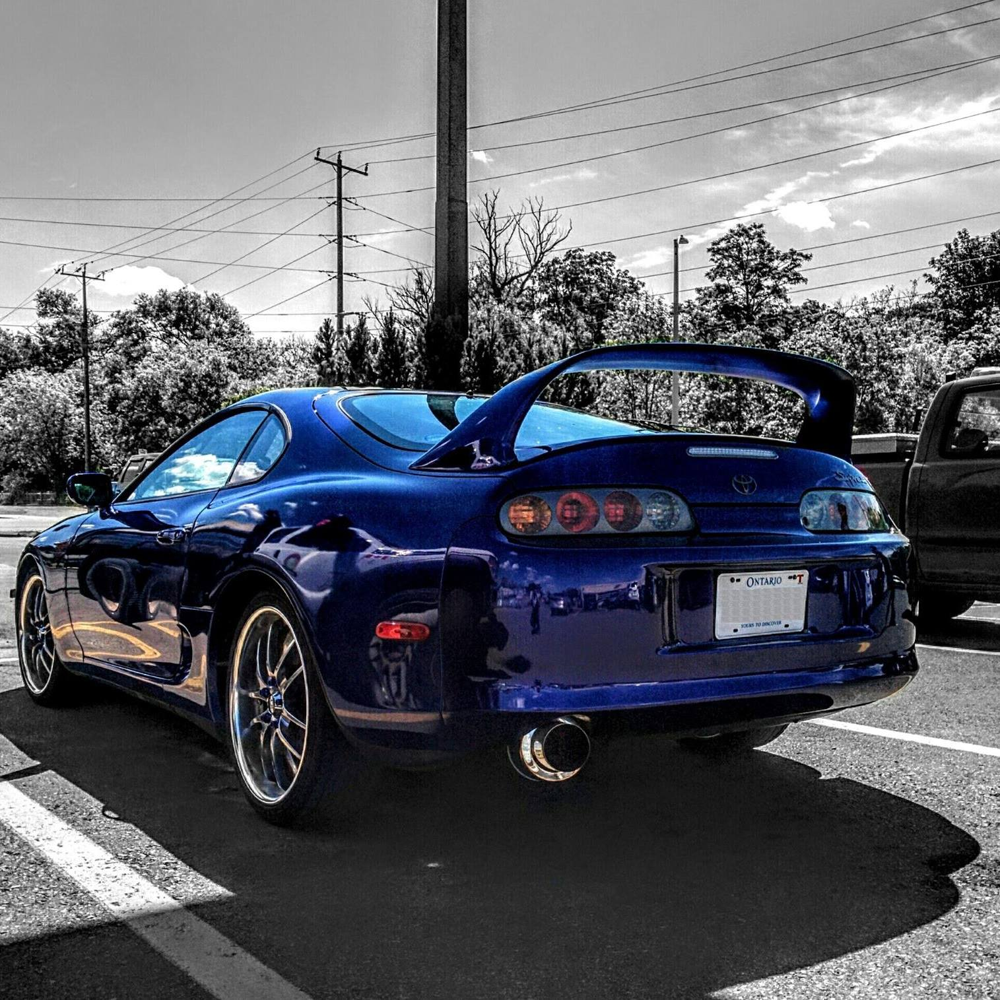

# 96-Supra-Turbo-Build

Welcome to my 1996 Toyota Supra Build files.

#Motor
2JZGE with 100,000 km or approx 66,000 miles
Completely stock except HKS cold air intake and Vibrant 3" Cat back

#Parts List
* Turbo: Garrett GT4094R Ball Bearing
* Manifold: BoostLogic 321SS
* Wategate: Tial V44
* Intercooler: CXRacing 29.5x8x3.5 2.5" outlet
* Downpipe: Custom made
* BOV: tbd
* ECU: MegaSquirt Pro Module (3D printing custom case)
* Injectors: RC850cc
* Differential: Torsen LSD
* Transmission: W58 5 speed (for now)
* Fuel Pump: 2x Denso 240lph
* Catch Can: Greddy
* Brakes: Lexus LS400

\*tbd: to be determined

#General Milestones
1. Get motor running on MegaSquirt ecu
2. Get turbo parts fitted and tested (no manifold connection)
3. Plumb turbo and tune for positive manifold pressure (max 350-400 hp)
4. Change to thicker head gasket and add injectors/other supporting mods for 600hp

#I am currently working on: 
Building custom ECU case and harness

##Completed:
* Megasquirt wiring plan, Inputs and Outputs

#More to come, I've only just started!
Most of the planning occurs in PLAN.gan which is a GANTT chart breakdown of all the steps needed for the build.
